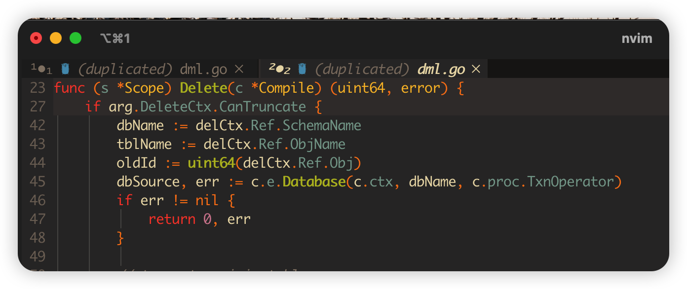
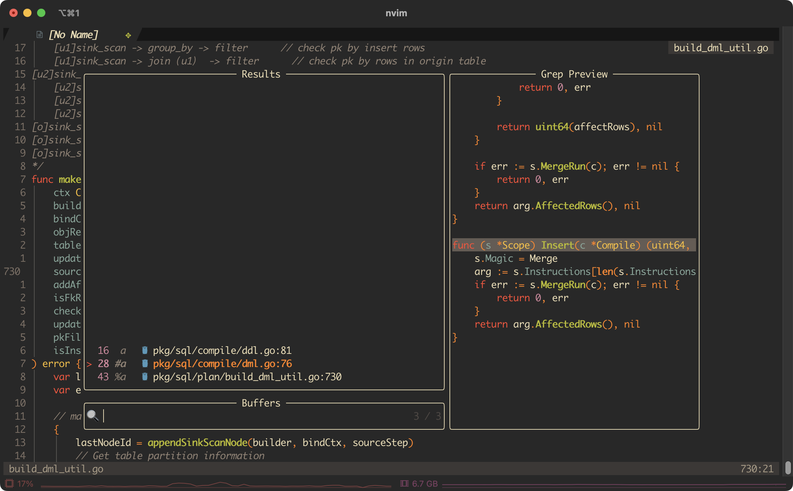
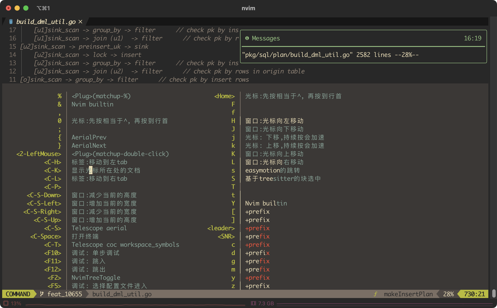
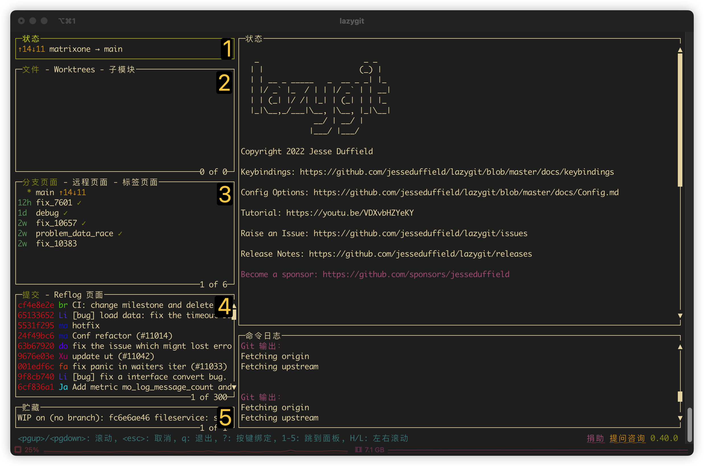
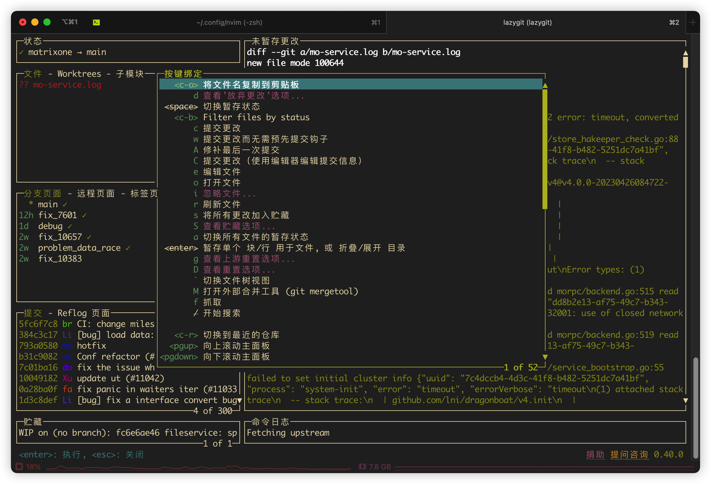

# README

这篇文档做两个事情：

1. 自查
2. 一定的可读性，给感兴趣的朋友看看


## core

这里会介绍一些我设置的快捷键。


### before we start 0：`buffer/window/tab`

如果你不清楚`buffer/window/tab`三者的联系和区别的话，可以先顺着看一下下面，因为`vim`的处理逻辑和普通的`ide`并不一样，`vim`中拥有更高的灵活度，所以需要了解一下，不然会平添很多困惑。在处理真实的项目时会感觉到不自然，`buffer` 可以绑定在窗口上，但即使窗口关闭，缓冲区依然存在，你也可以用多个窗口打开同一个`buffer`，这样就会有`duplicated`的情况发生，看上去挺尴尬的。



但是另一方面，这种方式又能提供更多的自由——这里有一些[讨论](https://www.reddit.com/r/neovim/comments/11itoab/how_do_you_manage_tabs_and_split_panes_in_vim/)，你也许想要看看，或者直接看看`vim expert`是如何思考这个[问题](https://stackoverflow.com/questions/26708822/why-do-vim-experts-prefer-buffers-over-tabs/26710166#26710166)的。

-   `Buffer` 是 `vim` 打开文件的时候创建的一个缓冲区，用来存储打开的文件 。 使用 `vim` 每打开一个文件就会创建一个 `Buffer` 。
-   窗口是用来展示 Buffer 的信息的
-   Tab 可以想象成浏览器中的标签页，不同之处是 vim 中的 一个`Tab`可以有很多个窗口，每个窗口用来展示文件的内容信息。


`vim expert`相对于`tab`来说并不偏爱`buffer`，他们**将缓冲区用作文件的代理，将标签页用作工作区的区分**，它们可能有点让人混淆，因为大多数“现代”文本编辑器和集成开发环境使用标签的隐喻来表示加载的文件。

同时`vim`无法在不写入当前缓冲区或放弃更改的情况下切换到另一个缓冲区。不了解该选项的新用户别无选择，只能转而使用繁重的窗口或最接近的“类似标签”的功能：标签页，这是一个不幸的名称，especially in an era dominated by the idea that reading documentation is a waste of time.

**在Vim中，标签页是在窗口之上构建的一种抽象，窗口本身是在缓冲区之上构建的一种抽象。每个新的层次都增加了有用的功能，但限制了你的工作流程**。

>   这倒不能算是一种PUA，但是你感觉不太对的时候可以先double check一下自己有没有理解为什么要这么设计。

#### The “buffer way”

With a buffer-based workflow, the files you are working with are distributed along a single dimension，这句话的意思应该是指`buffer`这个概念本来的作用，也就是一个`buffer`天然地对应到多个文件。



可以看到，当前窗口可以打开`n`个`buffer`，但只有一个`buffer`现在可见，想要切换它按下`tab/shift+tab`就可以了。想要呼唤出这个`buffer`的管理界面，按下`<leader>b`即可。

***Buffers are Vim's file-proxies. If you think in terms of files, you think in terms of buffers.\***

实际上，就这个功能就对标掉其他ide常见的`tab`功能了，如果想要用`windows`，或者更糟糕地，使用`tab`来管理多文件的话，那会带来不必要而且很奇怪的混乱。

#### The “Window way”

只有一个`buffer`就不需要专门再造`window`的概念了，使用窗口在打开的文件之间导航变得过于复杂或过于简单，主要是因为**你可以/被迫使用两组命令来完成本质上相同的事情：访问一个缓冲区。**

因为使用基于窗口的workflow来管理多文件时，文件既沿着只是用缓冲区时的虚拟维度分布，还沿着另外两个物理上的纬度（上下切分和左右切分）——所以移动到另一个缓冲区时仍然意味着移动到另外一个文件，但移动到另外一个窗口就不见得了，窗口有其用途，但它们没有足够的能力来取代缓冲区的地位。

比如说你想要看同一个文件的头部和底部的时候，就可以新开一个窗口。

***Windows are not designed as file-proxies and can't be made into ones: they are "containers" or "viewports" designed to offer you a view into a buffer. No more, no less.\***

#### The “Tab way”

使用基于标签页的工作流程，你基本上试图模仿你从以前的编辑器中习惯的用户体验，完全忽略了Vim的标签页的本质。

由于没有实际的方法将文件/缓冲区与标签页绑定在一起，基本上只有一种实际的方法在标签页/缓冲区/文件之间导航：循环，在不考虑插件的前提下没有其他的快速跳转方式。

所以：

-   为了n个文件开n个Tab页面的方式不是`vim expert`会去做的
-   为了`2`个特定的任务，开`2`个Tab是`vim expert`会去做的

***Tab pages are "containers" or "viewports" designed to contain one or more windows, themselves also "containers" designed to contain buffers.\***

#### In conclusion

再次强烈建议看看[原文](https://stackoverflow.com/questions/26708822/why-do-vim-experts-prefer-buffers-over-tabs/26710166#26710166)。

"Vim experts" **don't prefer buffers over tabs:** they just use Vim as it was designed and are perfectly comfortable with that design:

-   "Vim experts" have 2, 30 or 97 buffers loaded and are very happy they don't have to deal with spatial distribution;
-   when they need to compare two files or work in one part of the current buffer while keeping another as a reference, "Vim experts" use windows because that's how they are meant to be used;
-   when they need to work for a while on a separate part of the project without messing with their current view, "Vim experts" load a brand new tab page.

## plugin

下面摘选了一些我喜欢的插件，它们大多都是从blog上遴选的，相关的link我放在了ref中：可以去看看[Awesome Neovim](https://github.com/rockerBOO/awesome-neovim)这个仓库。


### before we start 1：[which key](https://github.com/folke/which-key.nvim)

置了这么多快捷键, 记不住怎么办? which-key 来帮忙！



命令行输入`:WhichKey`就会弹出这个界面了。

### beautify

这里介绍一些让`neovim`能看起来不逊于`ide`的插件，一般都是配置好就可以用了，不用再去管它。

#### [bufferline](https://github.com/akinsho/bufferline.nvim)


#### [nvim-lastplace](https://github.com/ethanholz/nvim-lastplace)

-   自动记忆当前文件位置，在下次打开时定位到上次位置。

#### [gruvbox](https://github.com/ellisonleao/gruvbox.nvim)

-   这几乎就是我想要的主题，~~只有年轻人才会喜欢黑色，我已经老了。~~

#### 基于[tree-sitter](https://github.com/nvim-treesitter/nvim-treesitter)的插件

`tree-sitter`可以基于AST对代码语法进行解析，这样的高亮做出来很不错。

##### [nvim-ts-rainbow2](https://github.com/HiPhish/nvim-ts-rainbow2)

-   将配对的括号进行彩色的标注，方便辨认。

##### [nvim-treesitter-context](https://github.com/nvim-treesitter/nvim-treesitter-context)

-   它可以将当前函数的函数头固定在neovim界面的前几行，让你知道当前在编辑的是什么类、函数或方法。

### curosr

对于光标移动相关的插件实际上也可以进行分类


#### 光标移动


##### [flash](https://github.com/folke/flash.nvim)

结合了[easymotion](https://github.com/easymotion/vim-easymotion)和[clvever-f](https://github.com/rhysd/clever-f.vim)的功能, 还有Treesitte集成，功能也十分强大

-   `s`：和`easymotion`类似，后面跟上两个字母实现快速跳转，但是比`easymotion`还能少按一次。
-   `S`：


##### [vim-matchup](https://github.com/andymass/vim-matchup)

在vim中，按下%会跳转到当前光标所在位置的配对括号（如圆括号、方括号、花括号）的另一半括号位置。这个功能在编辑代码时非常有用，可以快速定位到配对的括号上，方便代码的阅读和编辑。

这个插件，可以基于`treesitter`扩展`%`键能力，在配置里面也已经设置好了，其他还有一些快捷键，但是我们可以不用管了，`z%` 可以go inside，但是我们也不见得需要它来跳转。


##### [vim-bookmarks](https://github.com/MattesGroeger/vim-bookmarks)

默认的快捷键也已经很好了，但我也重新配置了一遍并做了一些小小的修改，直接集成``telescope`插件的查找，`ma`查看当前文件下的所有书签，`mA`查看当前项目下的所有书签。同时在`whichkey`中能看到更加友好的注释，

| Action                                     | Shortcut |
| ------------------------------------------ | -------- |
| Add/remove bookmark at current line        | `mm`     |
| Add/edit/remove annotation at current line | `mi`     |
| Jump to next bookmark in buffer            | `mn`     |
| Jump to previous bookmark in buffer        | `mp`     |
| Show current file bookmarks                | `ma`     |
| Show all bookmarks (toggle)                | `mA`     |
| Clear bookmarks in current buffer only     | `mc`     |
| Clear bookmarks in all buffers             | `mx`     |


****


#### textobjs

这里的插件功能都很强大，还没有怎么学会。

##### [nvim-treesitter-textsubjects](https://github.com/RRethy/nvim-treesitter-textsubjects)

根据光标位置自动决定要选中什么textobject

使用方式：快捷键使用（以v选中模式举例）

-   `v.`：根据光标位置，智能选择
-   `v,`：选中上一次选中的范围
-   `v;`：选中容器外围
-   `vi;`：选中容器内

##### [nvim-various-textobjs](https://github.com/chrisgrieser/nvim-various-textobjs)

为neovim新增很多textobjects，它们可以丰富你的快捷键选中、复制、修改等操作的体验。

使用方式：快捷键使用（以选中功能"v"来举例，可以替换为"c"（删除并修改）、"d"（删除）、"y"复制等）（`i`可以替换为`a`，`i`表示"inner"，`a`表示"outer"，如`va}`会选中包括`}`本身的内容，而`vi}`则不会）

-   `viS`：选中当前光标下的子word（如`VimEnter`，我们使用`viw`会选中整个`VimEnter`，但`viS`只会选中`Enter`或`Vim`）
-   `vii`：选中当前相同缩进的所有行
-   `vR`：选中当前相同缩进往后剩余的行
-   `v%`：选中当前光标下对应的括号结束位置
-   `vr`：选中剩余的段落
-   `vgG`：选中整个文件
-   `v_`：选中整行有字符的部分（除去空白字符）
-   `viv`：选中key-value的value部分
-   `vik`：选中key-value的key部分
-   `vL`：选中URL
-   `vin`：选中数字部分
-   `v!`：选中诊断部分（需要LSP）
-   `vil`：选中markdown的链接
-   `viC`：选中markdown的代码块部分
-   `vic`：选中css选择器
-   `vi/`：选中javascript的正则表达式pattern
-   `viD`：选中双中括号内容`[[]]`

##### [nvim-treesitter-textobjects](https://github.com/nvim-treesitter/nvim-treesitter-textobjects)

简介：基于nvim-treesitter的textobjects，可以帮你选中class、function等语法内容

使用方式：快捷键使用，类似于nvim-various-textobjs（以选中模式`v`举例）

1.  选择

-   `vaf`：选中当前函数
-   `vac`：选中当前类内容
-   `vas`：选中当前scope
-   `vad`：选中当前条件（if..else）

1.  跳转

-   `]m`：跳到下一个函数的开始处
-   `]]`：跳到下一个类的开始处
-   `]s`：跳到下一个scope的开始处
-   `]z`：跳到下一个fold的开始处
-   `]M`：跳到下一个函数的结尾处
-   `][`：跳到下一个类的结尾处
-   `[m`：跳到上一个函数的开始处
-   `[[`：跳到上一个类的开始处
-   `[M`：跳到上一个函数的结尾处
-   `[]`：跳到上一个类的结尾处
-   `]d`：跳到下一个条件
-   `[d`：跳到上一个条件


****


#### 其他

前两个是与`insert mode`相关


##### [tabout.nvim](https://github.com/abecodes/tabout.nvim)

可以在Insert模式下，按`<Tab>`可以跳出各种的右括号什么的 —— 这个东西默认跟`coc-nvim`的自动补齐会有冲突，但是在coc-nvim.lua中应该已经配置好了，详情可以看coc-nvim下的`SmartTab`函数。


##### [nvim-surround](https://github.com/kylechui/nvim-surround)

这个似乎比`vim-surround`好用一些，它的默认配置我就不修改了。

###### basic

-   `add`：`ys{motion}{char}`
-   `delete`：`ds{motion}{char}`
-   `change`：`cs{target}{replacement}`

For the following examples, `*` will denote the cursor position:

```
    Old text                    Command         New text
--------------------------------------------------------------------------------
    surr*ound_words             ysiw)           (surround_words)
    surr*ound_words             ysiw(           ( surround_words )
    *make strings               ys$"            "make strings"
    [delete ar*ound me!]        ds]             delete around me!
    remove <b>HTML t*ags</b>    dst             remove HTML tags
    'change quot*es'            cs'"            "change quotes"
    <b>or tag* types</b>        csth1<CR>       <h1>or tag types</h1>
    delete(functi*on calls)     dsf             function calls
```

###### (less) More mapping

下面的例子摘抄自文档，我挑了些我觉得可能有用的记录。对于`ys`来说它有一些变体，比如说`yss`会忽略掉一些空格，`yS`和`ySS`类似于`ys`和`yss`，但是会把分割符新起一行：

```
    Old text                    Command         New text
    --------------------------------------------------------------------------------
    hel*lo world                yss"            "hello world"
    some content                ySStp           <p>
                                                some content
                                                </p>
   func(a*rgs)                  cS))            func(
                                                    args
                                                    )
```

一些跟`html`相关的我就不记录了，但是这个`f`是有点有趣的：

```Go
   Old text                    Command         New text ~
    arg*s                       ysiwffunc       func(args)
    f*unc_name(a, b, x)         dsf             a, b, x
    f*unc_name(a, b, x)         csfnew_name     new_name(a, b, x)
```

###### Aliasing

默认地对`()`和`[]`是有别名的，分别是`b`和`r`，`{}`的对应是`B`，这样按起来更快——看下面的例子，

```
    Old text                    Command         New text ~
    sample* text                yssb            (sample text)
    sample* text                yssB            {sample text}
    [more stuff]                dsr             more stuff
    use["nvim*-surround"]       csrb            use("nvim-surround")
```

还有一个别名是`q`，`q` 可以对应 ``,',"`这么多种`pair`，因为我们只在删除的时候用它，看下面的例子。

```Go
    Old text                    Command         New text ~
    "Nested '*quotes'"          dsq             "Nested quotes"
    "Nes*ted 'quotes'"          dsq             Nested 'quotes'
    "Nes*ted 'quotes'"          csqb            (Nested 'quotes')
```

###### Jump

如果光标不在`surrounding pair`中，它可以自动地跳到最近的`pair`里面进行操作，它移动优先级文档我觉得说得也不太清楚，直接看例子吧，其实是很直觉的。

```
    Old text                    Command         New text ~
    "hello"* 'world'            dsq             "hello" world
    "hello" world*              csqB            {hello} world
    *some "'nested' quotes"     dsq             some 'nested' quotes
    "'nested' quotes" t*ext     dsq             'nested' quotes text
```


****


### ide

这里介绍一些让`neovim`能用起来不逊于`ide`的插件


#### [coc-nvim](https://github.com/neoclide/coc.nvim)


#### [telescope](https://github.com/nvim-telescope/telescope.nvim)


#### [nvim-tree](https://github.com/nvim-tree/nvim-tree.lua)

总得需要一个目录树，它的快捷键也相当多。


#### [lazygit](https://github.com/jesseduffield/lazygit#homebrew)

>   Rant time: You've heard it before, git is *powerful*, but what good is that power when everything is so damn hard to do? Interactive rebasing requires you to edit a goddamn TODO file in your editor? *Are you kidding me?* 

`lazygit`是一个在终端下**符合`vim`直觉**的`git`客户端，使用了`neovim`的插件之后（按下`<leader>G`），即可在`vim`里打开它，而且你完全可以用鼠标/触摸板！

下面结合图片简要地介绍一下它的用法——



对于不同的工作区（文件，分支界面，提交记录，存储就是`stash`——也就是隐藏的更改）等，可以直接按数字进行对应的跳转（`tab`和`shift+tab`也可以进行工作区之间的快速切换，`h`和`l`也可以）。

“符合`vim`直觉”这个事情会给你带来许多惊喜——`j`和`k`在工作区内进行移动（`h/l`是在工作区间），`/`的搜索当然也可以用，`d`会删除一些东西（具体情况下删除的对象会有点不一样，但都很符合直觉）。`q`退出回去终端，`esc`回到上一个页面，`enter`进入下一级操作。

按下`?`就可以弹出帮助界面，它会贴心地弹出对应工作区下涉及的快捷指令。



你（我）已经知道怎么查阅文档了，下面只会记录一些我常用的快捷键。

##### 与远端仓库的交互

-   `p`：更新仓库
-   `P`：推送到仓库
-   `u`：设定链接的远端仓库
    -   之所以需要专门提这一嘴是因为我开发的工作流默认有两个远端仓库`origin`和`upstream`，在没有自定义`lazygit`的命令之前，我偶尔需要设定一下它

##### 工作区操作

-   文件：按下`1`跳转到文件
    -   `<space>`用于将文件加入和移出工作区，`a`用于对所有文件加入/移出
        -   按`tab`可以在`staged`和`unstaged`的页面之间进行切换
        -   可以对某个文件按下`Enter`，然后针对特定的修改按下`<space>`进行行级别的`stage`
        -   在`staged`的页面，可以按下`d`进行行级别的`unstage`
    -   `c`：提交代码
    -   `d`：重置当前文件，`D`重置所有文件（会有更多放弃更改的选项）
    -   `s`：暂存所有文件，`S`暂存选中文件
        -   可以设定个名字
-   分支管理：按下`3`跳转到分支管理
    -   `<space>`：切换分支
    -   `n`：创建新的分支
    -   `d`：删除分支
    -   `r`：rebase分支：把选中的分支合并到当前分支，`m`同理
    -   `g`
-   提交记录：按下`4`跳转到提交记录
    -   `d`：删除提交
    -   `g`：重置到指定提交，它也会显示更多的选项
    -   `r`：改写提交的comment
    -   `A`：把当前的`stage`添加到上一次提交中
    -   `s`：把选中的`commit`和它下面一个`commit`进行合并，`f`（fixup）也能起到类似的效果 —— 这些东西都是`rebase` 的选项

-   `stash`管理：按下`5`跳转到贮藏
    -   `g`：应用并删除（也就是`pop`）

##### 解决冲突

-   上下左右键进行冲突之间的移动，`vim`的快捷键应该也行叭。

-   `<space>`：选中某一种更改，`b`两种更改都想要

##### 其他的操作

-   查看某个文件的历史记录
    -    在`commit`的工作区，~~`<c-f>`可以进行`filter`~~，可以过滤出修改过某个文件的`commits`
    -   得查查这个快捷键现在是什么了

-   `commit`之间的`diff`
    -    在`commit`的工作区，`W`


想要更新手友好的学习资料？可以看看[这个](https://www.bilibili.com/video/BV1gV411k7fC/?spm_id_from=333.1007.top_right_bar_window_history.content.click&vd_source=d15d9e4ac1d8a1510dd3fb4eba690017)。


#### [persistence.nvim](https://github.com/folke/persistence.nvim)

自动保存你的session到文件中，在下次打开相同目录/项目时，你可以手动加载session恢复之前的工作状态。


### 未来

下面是一些只是可能未来有用的插件，但是我现在还用不上，现在收集起来以后就能懒得找了


#### [nvim-spectre](https://github.com/nvim-pack/nvim-spectre)

简介：搜索并替换项目中所有文件/当前文件/当前选中区域的内容

使用方式：快捷键使用


#### [search-replace.nvim](https://github.com/roobert/search-replace.nvim)

简介：受够了手动输入`:%s/xxx/ccc/gcI`吗？这款插件可以使用快捷键一键帮你输入这些内容。 这款插件是spectre插件的补充，你可以用这款插件或者spectre插件来达到全局文件替换的效果。

使用方式：快捷键使用

1.  当前缓冲区：

-   `<leader>rs`：打开选择列表（个人不会用）
-   `<leader>ro`：打开Cmdline，自动帮你键入好了`:%s//gcI`
-   `<leader>rw`：打开Cmdline，自动帮你键入好了当前光标所在的word
-   `<leader>rW`：打开Cmdline，自动帮你键入好了当前光标所在WORD
-   `<leader>re`：...
-   `<leader>rf`：...

1.  所有打开的缓冲区：同上，但是前缀是`<leader>rb`，只要多加一个`b`键即可 具体快捷键见下面的“快捷键配置”

配置：

```
{
    "roobert/search-replace.nvim",
    lazy = true,
    cmd = {
        "SearchReplaceSingleBufferVisualSelection",
        "SearchReplaceSingleBufferOpen",
        "SearchReplaceWithinVisualSelection",
        "SearchReplaceWithinVisualSelectionCWord",
        "SearchReplaceSingleBufferSelections",
        "SearchReplaceSingleBufferCWord",
        "SearchReplaceSingleBufferCWORD",
        "SearchReplaceSingleBufferCExpr",
        "SearchReplaceSingleBufferCFile",
        "SearchReplaceMultiBufferSelections",
        "SearchReplaceMultiBufferOpen",
        "SearchReplaceMultiBufferCWord",
        "SearchReplaceMultiBufferCWORD",
        "SearchReplaceMultiBufferCExpr",
        "SearchReplaceMultiBufferCFile",
    },
    config = function()
        require("search-replace").setup({
            default_replace_single_buffer_options = "gcI",
            default_replace_multi_buffer_options = "egcI",
        })
    end,
}
```


快捷键配置：

```
-- search.replace.nvim config BEGIN
keymap["r"] = {
    name = "SearchReplaceSingleBuffer",
    s = { "<CMD>SearchReplaceSingleBufferSelections<CR>", "SearchReplaceSingleBuffer [s]elction list" },
    o = { "<CMD>SearchReplaceSingleBufferOpen<CR>", "[o]pen" },
    w = { "<CMD>SearchReplaceSingleBufferCWord<CR>", "[w]ord" },
    W = { "<CMD>SearchReplaceSingleBufferCWORD<CR>", "[W]ORD" },
    e = { "<CMD>SearchReplaceSingleBufferCExpr<CR>", "[e]xpr" },
    f = { "<CMD>SearchReplaceSingleBufferCFile<CR>", "[f]ile" },
    b = {
        name = "SearchReplaceMultiBuffer",
        s = { "<CMD>SearchReplaceMultiBufferSelections<CR>", "SearchReplaceMultiBuffer [s]elction list" },
        o = { "<CMD>SearchReplaceMultiBufferOpen<CR>", "[o]pen" },
        w = { "<CMD>SearchReplaceMultiBufferCWord<CR>", "[w]ord" },
        W = { "<CMD>SearchReplaceMultiBufferCWORD<CR>", "[W]ORD" },
        e = { "<CMD>SearchReplaceMultiBufferCExpr<CR>", "[e]xpr" },
        f = { "<CMD>SearchReplaceMultiBufferCFile<CR>", "[f]ile" },
    },
}
lvim.keys.visual_block_mode["<C-r>"] = [[<CMD>SearchReplaceSingleBufferVisualSelection<CR>]]
lvim.keys.visual_block_mode["<C-s>"] = [[<CMD>SearchReplaceWithinVisualSelection<CR>]]
lvim.keys.visual_block_mode["<C-b>"] = [[<CMD>SearchReplaceWithinVisualSelectionCWord<CR>]]
vim.o.inccommand = "split"
-- search.replace.nvim config END
```


#### [nvim-bqf](https://github.com/kevinhwang91/nvim-bqf)

简介：增强你的quickfix窗口

使用方式：配置即可显示增强的quickfix窗口，然后在quickfix窗口内使用对应快捷键操作quickfix


### [nvim-recorder](https://github.com/chrisgrieser/nvim-recorder)

简介：大幅简化和增强neovim自身的宏功能。允许你编辑、复制宏的内容以及设置断点

使用方法：快捷键使用

-   `q`：开始/结束录制宏
-   `Q`：执行当前选择的宏
-   `<A-q>`：切换宏槽位
-   `cq`：编辑当前槽位的宏
-   `yq`：复制当前槽位的宏

注：本配置仅使用了"u", "i", "o"三个槽位，如果需要更多槽位可以自行配置`slot`项。

配置：

```
{
    "chrisgrieser/nvim-recorder",
    lazy = true,
    keys = { "q", "Q", "<A-q>", "cq", "yq" },
    config = function()
        require("recorder").setup({
            slots = { "u", "i", "o" },
            mapping = {
                startStopRecording = "q",
                playMacro = "Q",
                switchSlot = "<A-q>",
                editMacro = "cq",
                yankMacro = "yq",
                -- addBreakPoint = "###",
            },
        })
    end,
}
```


## Reference:

1. https://github.com/ayamir/nvimdots
2. https://github.com/ADkun/lvim-config-suggest
3. https://github.com/gibfahn/dot (帮助我改写了coc-nvim的默认配置)


## FQA


### 很多地方都是空白或者显示的字符/icon都不太对。？

这是因为没有安装`Nerd-Font`，这是一系列包含了很多图标的字体，可以到 [Nerd-Font官网](https://www.nerdfonts.com/font-downloads) 下载。

-   by the way，我是用的是[monaco-nerd-fonts](https://github.com/Karmenzind/monaco-nerd-fonts), 你应该会注意到我把这个字体放置在了README相同的目录下

### 配置了插件以后，感觉很卡怎么办

打开lazy.nvim插件管理器的插件列表，然后按`P`进入`Profile`界面，然后按`<C-s>`按时间排序， 可以看到哪些插件使用的时间最多，考虑将这个插件卸载或使用更合理的lazy加载时机。 一般来说，如果按本文的给出的配置进行设置，不会出现特别卡顿的情况，除非电脑的配置太差，这时候可以考虑卸载一部分对性能影响很大的插件。

