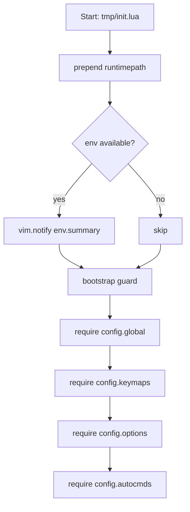

# config 层验收与常用 API 速查

- 大纲
    - 快速验收路径与建议的验证命令
    - 代码结构与加载流程图
    - 常用 API 速查: 选项、映射、自动命令、通知、命令、事件循环
    - 典型场景与代码片段: 引用具体行号
    - 调试与诊断套路
    - 迁移到插件阶段的策略与权衡

---

## 快速验收路径与建议的验证命令

- 大纲
    - 最小使用方式与 headless 验收
    - 平台位与路径只读性检查
    - 文本类/交互体验关键选项检查
    - 常见问题定位快捷命令

## 最小使用方式

- 已运行会话临时加载:

```vim
:luafile /Users/jensen/.config/nvim/tmp/init.lua
```

- 从终端直接以 tmp 配置启动:

```sh
nvim -u /Users/jensen/.config/nvim/tmp/init.lua --noplugin
```

## headless 快验

- 一致性与路径读取:

```sh
nvim -u /Users/jensen/.config/nvim/tmp/init.lua --headless -n +'lua local env=require("config.env"); local g=require("config.global"); print(vim.inspect({ env={ is_mac=env.is_mac,is_linux=env.is_linux,is_windows=env.is_windows,is_wsl=env.is_wsl }, global={ is_mac=g.is_mac,is_linux=g.is_linux,is_windows=g.is_windows,is_wsl=g.is_wsl, vim_path=g.vim_path } }))' +qa
```

- 只读写入应失败:

```sh
nvim -u /Users/jensen/.config/nvim/tmp/init.lua --headless -n +'lua local ok,err=pcall(function() require("config.global").vim_path="x" end); if ok then print("WRITE_OK") else print(err) end' +qa
```

## 文本类/交互体验关键选项检查

- 消息与交互:

```vim
:set shortmess?
:set updatetime?
```

期望: `shortmess` 含 `astWAIcC` (在 `tmp/lua/config/options.lua:71-81` 通过 `opt.shortmess:append` 设置); `updatetime=200` (`tmp/lua/config/options.lua:24-26`).

- 文本类优化:

```vim
:setlocal conceallevel? formatoptions?
```

期望: `conceallevel=2`, `formatoptions` 不含 `o,t` (在 `tmp/lua/config/autocmds.lua:79-89` 的 `wrap_spell` autocmd 设置)。

- 分屏与撤销:

```vim
:set splitright? splitbelow? undofile?
```

期望: `splitright`/`splitbelow` 为 true (`tmp/lua/config/options.lua:152-154`), `undofile` 开启 (`tmp/lua/config/options.lua:110-112`).

- 目录自动创建: 保存到新路径前应自动创建父目录 (`tmp/lua/config/autocmds.lua:91-101`).

---

## 代码结构与加载流程图

- 大纲
    - 入口与模块加载顺序
    - 关键调用链路径

### 入口与加载顺序

- 入口: `tmp/init.lua`
    - 设置 runtimepath (`tmp/init.lua:13-15`)
    - 可选打印环境摘要, 使用 `vim.notify` (`tmp/init.lua:16-23`)
    - 幂等保护 (`tmp/init.lua:25-30`)
    - 加载 `config/global,keymaps,options,autocmds` (`tmp/init.lua:31-35`)



### 关键调用链

- 只读全局路径对象: `config.global`

```
config.global
├─ compute() -> 聚合 env 平台位与路径 (tmp/lua/config/global.lua:11-27)
├─ setmetatable(... __index/__newindex) (tmp/lua/config/global.lua:37-43)
└─ :load_variables() -> 显式重算 (tmp/lua/config/global.lua:33-35)
```

- 自动命令聚合: `config.autocmds`

```
config.autocmds
├─ augroup(name) (tmp/lua/config/autocmds.lua:13-15)
├─ checktime on Focus/Term (tmp/lua/config/autocmds.lua:17-21)
├─ im-select on ModeChanged (tmp/lua/config/autocmds.lua:23-37)
├─ highlight_yank (tmp/lua/config/autocmds.lua:39-45)
├─ resize_splits on VimResized (tmp/lua/config/autocmds.lua:47-53)
├─ close_with_q for FileType (tmp/lua/config/autocmds.lua:55-77)
├─ wrap_spell for markdown/gitcommit (tmp/lua/config/autocmds.lua:79-89)
├─ auto_create_dir on BufWritePre (tmp/lua/config/autocmds.lua:91-101)
└─ fix fold via BufEnter (tmp/lua/config/autocmds.lua:103-107)
```

---

## 常用 API 速查

- 大纲
    - 选项 API (全局/窗口/缓冲区)
    - 自动命令与分组
    - 键位映射
    - 通知与日志
    - 用户命令
    - 事件循环与调度
    - 文件系统与可执行检测

### 选项 API

- 全局选项: `vim.opt`

```lua
local opt = vim.opt
opt.updatetime = 200               -- tmp/lua/config/options.lua:24-26
opt.shortmess:append({ I = true }) -- tmp/lua/config/options.lua:71-81
opt.splitright = true              -- tmp/lua/config/options.lua:152-154
opt.undofile = true                -- tmp/lua/config/options.lua:110-112
```

- 窗口/缓冲区局部:

```lua
vim.opt_local.wrap = true          -- tmp/lua/config/autocmds.lua:84-87
vim.bo[bufnr].buflisted = false    -- tmp/lua/config/autocmds.lua:73-76
```

### 自动命令与分组

```lua
local group = vim.api.nvim_create_augroup("example", { clear = true })
vim.api.nvim_create_autocmd({"BufWritePre"}, {
  group = group,
  callback = function(ev)
    -- your logic here
  end,
})
-- 参考: tmp/lua/config/autocmds.lua:13-21,39-53,55-89,91-101
```

### 键位映射

- 原生 API 推荐:

```lua
vim.keymap.set("n", "<leader>w", ":w<CR>", { silent = true, noremap = true, desc = "Save" })
-- 在 autocmd 回调里按 buffer 绑定: tmp/lua/config/autocmds.lua:73-76
```

- 若需批量/DSL 化, 可引入工具层封装; `tmp/lua/config/keymaps.lua` 中演示了以 `utils.bind` 封装的方式，但在 tmp 环境下更建议直接使用 `vim.keymap.set` 以减少外部依赖。

### 通知与日志

- 基础通知:

```lua
vim.notify("config loaded", vim.log.levels.INFO, { title = "tmp/init" })
-- 参考: tmp/init.lua:20-22
```

- 结构化打印:

```lua
print(vim.inspect({ env = require("config.env").is_mac }))
```

- 将来可对接 notify/noice/nvim-notify: 统一替换 `vim.notify`, 为不同级别设置路由与节流。

### 用户命令

```lua
vim.api.nvim_create_user_command("configSummary", function()
  local env = require("config.env"); local g = require("config.global")
  vim.notify(env.summary(), vim.log.levels.INFO, { title = "env" })
  print(vim.inspect({ vim_path = g.vim_path }))
end, { desc = "Print config env/global" })
```

### 事件循环与调度

```lua
vim.schedule(function() vim.notify("scheduled") end) -- tmp/init.lua:20-22
vim.defer_fn(function() print("later") end, 200)
```

### 文件系统与可执行检测

```lua
local std = vim.fn.stdpath("config")              -- tmp/lua/config/global.lua:19
local ok = (vim.fn.executable("rg") == 1)         -- tmp/lua/config/env.lua:28-38
local out = vim.fn.system("im-select")            -- tmp/lua/config/autocmds.lua:31
```

---

## 典型场景与代码片段

- 大纲
    - 文本类文件体验一致性
    - 自动创建目录
    - 输入法恢复
    - 分屏尺寸自适应
    - 只读全局对象模式

### 文本类文件体验一致性

- 引用: `tmp/lua/config/autocmds.lua:79-89`

```lua
vim.api.nvim_create_autocmd("FileType", {
  group = augroup("wrap_spell"),
  pattern = { "gitcommit", "markdown" },
  callback = function()
    vim.opt_local.wrap = true
    vim.opt_local.spell = true
    vim.opt_local.conceallevel = 2
    vim.opt_local.formatoptions:remove({ "o", "t" })
  end,
})
```

### 自动创建目录

- 引用: `tmp/lua/config/autocmds.lua:91-101`

```lua
vim.api.nvim_create_autocmd({ "BufWritePre" }, {
  group = augroup("auto_create_dir"),
  callback = function(event)
    if event.match:match("^%w%w+://") then return end
    local file = vim.loop.fs_realpath(event.match) or event.match
    vim.fn.mkdir(vim.fn.fnamemodify(file, ":p:h"), "p")
  end,
})
```

### 输入法恢复

- 引用: `tmp/lua/config/autocmds.lua:23-37`

```lua
local ok_env, env = pcall(require, "config.env")
if ok_env and env.has.im_select then
  vim.api.nvim_create_autocmd({ "ModeChanged" }, {
    pattern = "i:n,i:v",
    group = augroup("im-select"),
    callback = function()
      local result = vim.fn.system("im-select")
      if not string.find(result, "com.apple.keylayout.ABC") then
        vim.fn.system("im-select com.apple.keylayout.ABC")
      end
    end,
  })
end
```

### 分屏尺寸自适应

- 引用: `tmp/lua/config/autocmds.lua:47-53`

```lua
vim.api.nvim_create_autocmd({ "VimResized" }, {
  group = augroup("resize_splits"),
  callback = function() vim.cmd("tabdo wincmd =") end,
})
```

### 只读全局对象模式

- 引用: `tmp/lua/config/global.lua:37-43`

```lua
setmetatable(global, {
  __index = function(_, k) return data[k] end,
  __newindex = function(_, k, _)
    error(string.format("config.global is read-only (attempt to write key '%s'). Use config.env or local variables.", tostring(k)), 2)
  end,
  __metatable = false,
})
```

---

## 调试与诊断套路

- 大纲
    - 自检命令
    - 可视化检查
    - Headless 场景化断言

### 自检命令

- 查看 `autocmd` 定义与来源:

```vim
:autocmd wrap_spell
:verbose set shortmess?
```

- 显示最近 `:messages` 与通知路由:

```vim
:messages
```

### 可视化检查

- 快速打印结构体:

```lua
print(vim.inspect(require("config.env")))
```

### Headless 场景化断言

- 见“快速验收路径”中的两条 headless 命令; 可在 CI 中直接执行。

---

## 迁移到插件阶段的策略与权衡

- 大纲
    - 状态的集中与隔离: env 为真源, global 只读
    - 条件加载与降级路径: 利用 env.has/minimal_mode
    - 通知统一路由: 以 vim.notify 为抽象点
    - 验收基线: 以 Headless 断言确保关键行为

### 建议

- 以 `config.env` 作为状态单一真源: 平台位与工具可用性仅在此处探测 (`tmp/lua/config/env.lua:20-38`).
- `config.global` 保持只读与可重算, 避免写时耦合; 出错要早且可观测 (`tmp/lua/config/global.lua:33-43`).
- 插件迁移优先满足“可用”再谈“最优”: 先以 env.minimal_mode 限制更新/重索引, 再逐项打开特性。
- 通知统一入口 `vim.notify`: 便于后续接入 noice/nvim-notify 实现风格统一与降噪。
