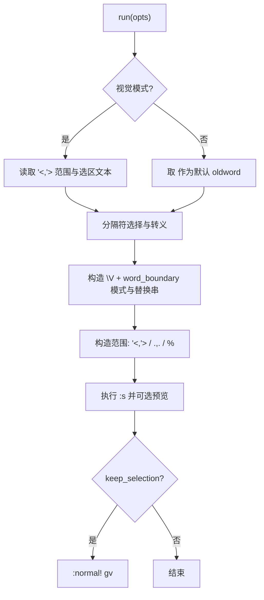

# quick_substitute 说明

意图: 提供健壮的可视/普通模式替换工具, 降低正则误匹配与分隔符冲突, 并改善交互体验.

核心能力:

- 作用范围: 可视选区 / 当前行 / 整个缓冲区
- 转义策略: \V very nomagic + 分隔符/反斜杠/& 的精确转义
- 交互体验: 默认从选区或 <cword> 推导旧词, 执行前可预览命令

API:

- `require("utils.quick_substitute").setup(opts?)`
- `require("utils.quick_substitute").run(opts?)`

可选项(opts):

- scope: "line"|"buffer" (非可视模式下有效; 默认 line)
- word_boundary: bool, 仅整词匹配(通过 \<, \> 实现)
- flags: string, 组合 g/c/i 等
- smartcase: bool, 遵循 ignorecase/smartcase 语义
- keep_selection: bool, 执行后用 `gv` 恢复上次可视选区
- nohlsearch: bool, 执行后 `:noh`
- preview: bool, 执行前 `:echo` 预览命令

调用路径示意:

```text
utils.quick_substitute.run
  -> in_visual_mode?
     -> get_visual_range -> get_selected_lines -> derive_default_oldword
     -> choose_delimiter -> build_pattern -> build_replacement
  -> build_range -> 组装 :s 命令 -> 执行 -> 可选 :normal! gv -> 可选 :noh
```

流程图:



设计权衡:

- 使用 \V 抑制魔法字符: 更符合“文本替换”直觉, 代价是放弃复杂正则; 如需强正则, 可关闭 \V 并提供正则输入模式.
- 同步输入(vim.fn.input): 实现简单清晰; 若要无阻塞交互, 可切换到 vim.ui.input.
- 范围最小化: 默认仅当前行, 降低误伤; 需要更大范围时显式切换.

已知限制:

- 多行可视选区时, 默认 oldword 仅取首行非空片段; 如需更复杂行为可扩展.
