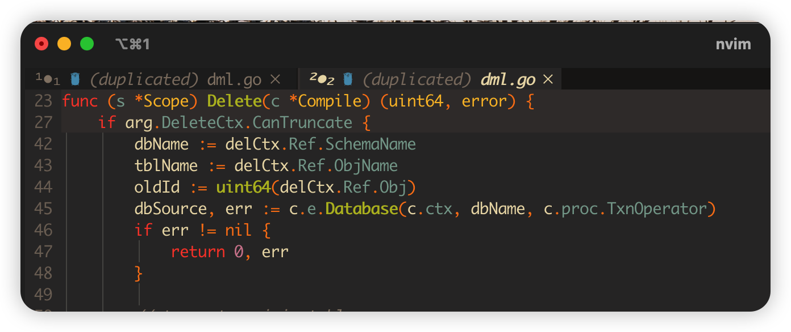

# README

<https://github.com/ap/vim-buftabline#why-this-and-not-vim-tabs>

这篇文档做两个事情：

1. 自查
2. 一定的可读性，给感兴趣的朋友看看

## core

这里会介绍一些我设置的快捷键。

### before we start 0：`buffer/window/tab`

如果你不清楚`buffer/window/tab`三者的联系和区别的话，可以先顺着看一下下面，因为`vim`的处理逻辑和普通的`ide`并不一样，`vim`中拥有更高的灵活度，所以需要了解一下，不然会平添很多困惑。在处理真实的项目时会感觉到不自然，`buffer` 可以绑定在窗口上，但即使窗口关闭，缓冲区依然存在，你也可以用多个窗口打开同一个`buffer`，这样就会有`duplicated`的情况发生，看上去挺尴尬的。

但是另一方面，这种方式又能提供更多的自由——这里有一些[讨论](https://www.reddit.com/r/neovim/comments/11itoab/how_do_you_manage_tabs_and_split_panes_in_vim/)，你也许想要看看，或者直接看看`vim expert`是如何思考这个[问题](https://stackoverflow.com/questions/26708822/why-do-vim-experts-prefer-buffers-over-tabs/26710166#26710166)的。

- `Buffer` 是 `vim` 打开文件的时候创建的一个缓冲区，用来存储打开的文件 。 使用 `vim` 每打开一个文件就会创建一个 `Buffer` 。
- 窗口是用来展示 Buffer 的信息的
- Tab 可以想象成浏览器中的标签页，不同之处是 vim 中的 一个`Tab`可以有很多个窗口，每个窗口用来展示文件的内容信息。

`vim expert`相对于`tab`来说并不偏爱`buffer`，他们**将缓冲区用作文件的代理，将标签页用作工作区的区分**，它们可能有点让人混淆，因为大多数“现代”文本编辑器和集成开发环境使用标签的隐喻来表示加载的文件。

同时`vim`无法在不写入当前缓冲区或放弃更改的情况下切换到另一个缓冲区。不了解该选项的新用户别无选择，只能转而使用繁重的窗口或最接近的“类似标签”的功能：标签页，这是一个不幸的名称，especially in an era dominated by the idea that reading documentation is a waste of time.

**在Vim中，标签页是在窗口之上构建的一种抽象，窗口本身是在缓冲区之上构建的一种抽象。每个新的层次都增加了有用的功能，但限制了你的工作流程**。

> 这倒不能算是一种PUA，但是你感觉不太对的时候可以先double check一下自己有没有理解为什么要这么设计。

#### The “buffer way”

With a buffer-based workflow, the files you are working with are distributed along a single dimension，这句话的意思应该是指`buffer`这个概念本来的作用，也就是一个`buffer`天然地对应到多个文件。

可以看到，当前窗口可以打开`n`个`buffer`，但只有一个`buffer`现在可见，想要切换它按下`tab/shift+tab`就可以了。想要呼唤出这个`buffer`的管理界面，按下`<leader>b`即可。

***Buffers are Vim's file-proxies. If you think in terms of files, you think in terms of buffers.\***

实际上，就这个功能就对标掉其他ide常见的`tab`功能了，如果想要用`windows`，或者更糟糕地，使用`tab`来管理多文件的话，那会带来不必要而且很奇怪的混乱。

#### The “Window way”

只有一个`buffer`就不需要专门再造`window`的概念了，使用窗口在打开的文件之间导航变得过于复杂或过于简单，主要是因为**你可以/被迫使用两组命令来完成本质上相同的事情：访问一个缓冲区。**

因为使用基于窗口的workflow来管理多文件时，文件既沿着只是用缓冲区时的虚拟维度分布，还沿着另外两个物理上的纬度（上下切分和左右切分）——所以移动到另一个缓冲区时仍然意味着移动到另外一个文件，但移动到另外一个窗口就不见得了，窗口有其用途，但它们没有足够的能力来取代缓冲区的地位。

比如说你想要看同一个文件的头部和底部的时候，就可以新开一个窗口。

***Windows are not designed as file-proxies and can't be made into ones: they are "containers" or "viewports" designed to offer you a view into a buffer. No more, no less.\***

#### The “Tab way”

使用基于标签页的工作流程，你基本上试图模仿你从以前的编辑器中习惯的用户体验，完全忽略了Vim的标签页的本质。

由于没有实际的方法将文件/缓冲区与标签页绑定在一起，基本上只有一种实际的方法在标签页/缓冲区/文件之间导航：循环，在不考虑插件的前提下没有其他的快速跳转方式。

所以：

- 为了n个文件开n个Tab页面的方式不是`vim expert`会去做的
- 为了`2`个特定的任务，开`2`个Tab是`vim expert`会去做的

***Tab pages are "containers" or "viewports" designed to contain one or more windows, themselves also "containers" designed to contain buffers.\***

#### In conclusion

再次强烈建议看看[原文](https://stackoverflow.com/questions/26708822/why-do-vim-experts-prefer-buffers-over-tabs/26710166#26710166)。

"Vim experts" **don't prefer buffers over tabs:** they just use Vim as it was designed and are perfectly comfortable with that design:

- "Vim experts" have 2, 30 or 97 buffers loaded and are very happy they don't have to deal with spatial distribution;
- when they need to compare two files or work in one part of the current buffer while keeping another as a reference, "Vim experts" use windows because that's how they are meant to be used;
- when they need to work for a while on a separate part of the project without messing with their current view, "Vim experts" load a brand new tab page.

## plugin

下面摘选了一些我喜欢的插件，它们大多都是从blog上遴选的，相关的link我放在了ref中：可以去看看[Awesome Neovim](https://github.com/rockerBOO/awesome-neovim)这个仓库。
